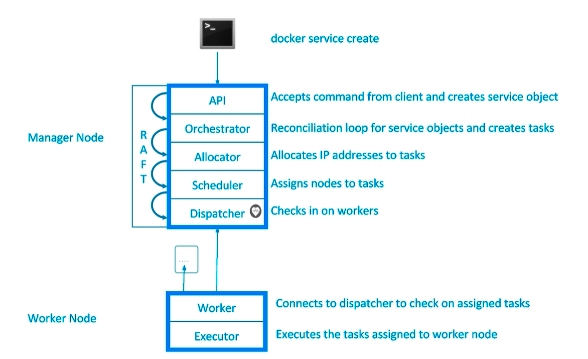

swarm

Raft databse created to store root CA configs and secrets
docker swarm init
docker node ls
docker service create alpine ping 8.8.8.8
docker service ls
1/1 left how many work are running
right is how many you specify to run
docker service ps optimistic_roentgen
docker service update bcodhcmu2bu4 --replicas 3

如果我们将一个 rm 了 那么他马上会 create 一个新的 worker
docker-machine create node
digital ocean
