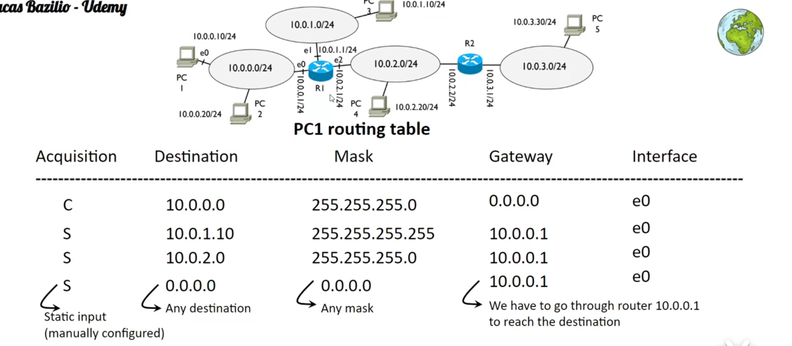
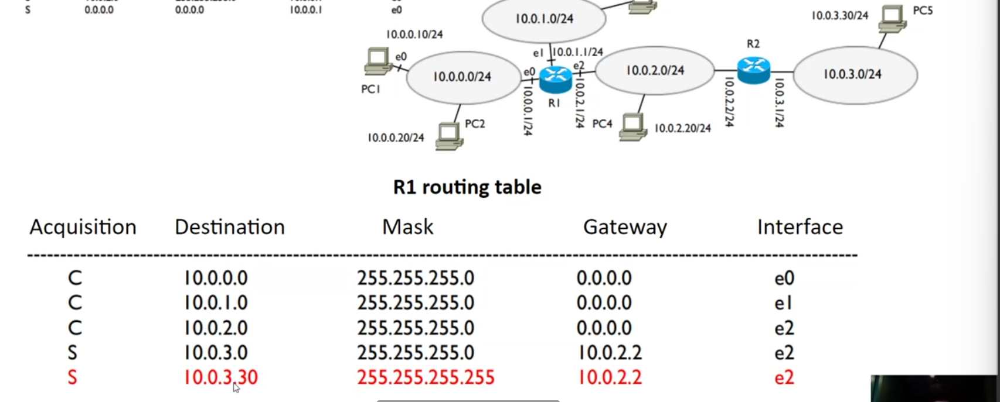
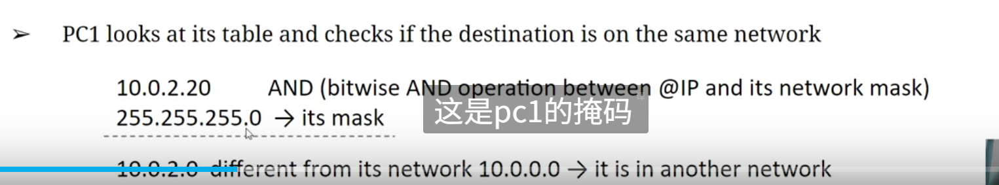
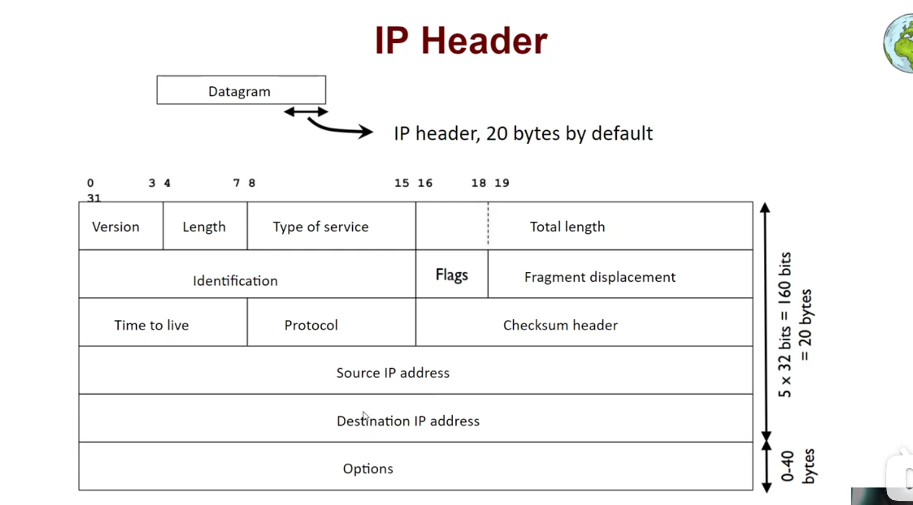

# Addressing

IANA internet assigned number authority
regional organizations called RIR
RIRs allocate smaller blocks to ISPs
The ISPs rent the @IP to the users

# Routing

Gateway: 0.0.0.0 没有必要经过路由器 目的地在本地

Router's routing table

检查是不是在一个网络中

check the destination is on one of its networks, first do AND and get
longest match lookup 255.255.255.255
second match lookup 255.255.255.0

# Terminal

route -n
sudo tcpdump -i lo
ping

# ARP

Address resolution protocol
IP layer may have to pass a physical address to the NIC diver
ARP translate ip address to physical addresses
if needed ip calls ARP module to obtain pa before NIC diver

ARP object have the lifetime. @ARP - @mac
arp -n

Frame
PC1 consults its ARP table and does not find the resolution
PC1 sends a broadcast arp request on its network asking for the @MAC ofI
IP 10.0.0.30
Frames do not cross networks, they only serve to communicate devices on the ssame network

ip->MAC 先查询 arp 表 然后如果没有 sent reply 就发到网关 然后在网关查询
重复此步骤

IP header

Fragmentation
MTU maximum transfer unit
indicates the max number of bytes that can be encapsulated in a Frame
identification flags and fragment displacement
