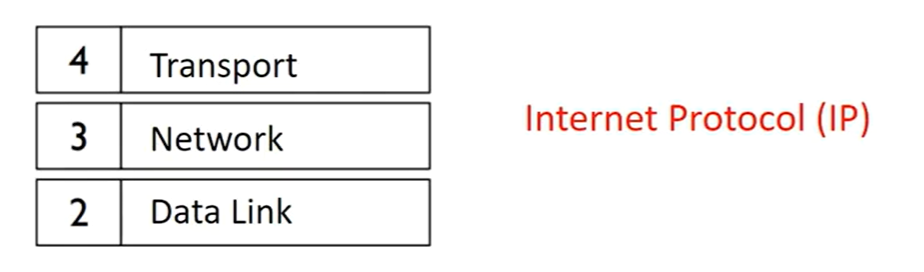
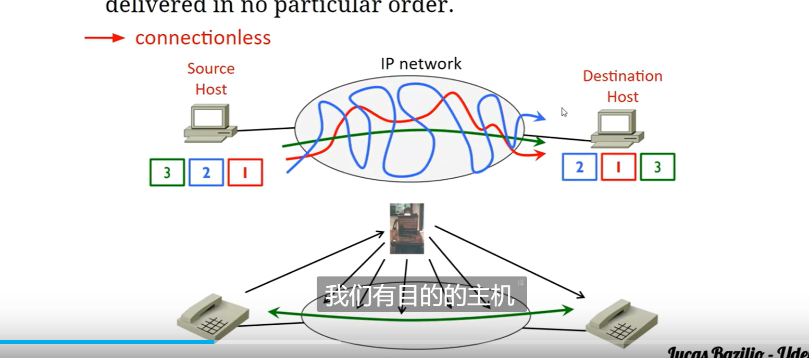
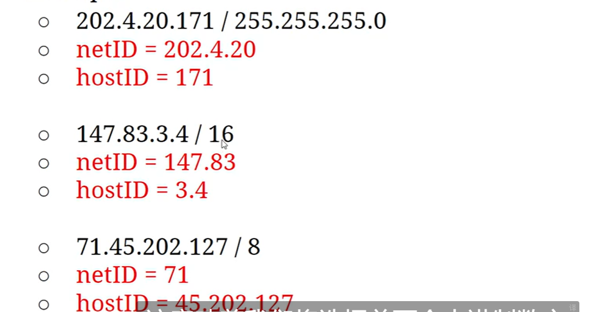
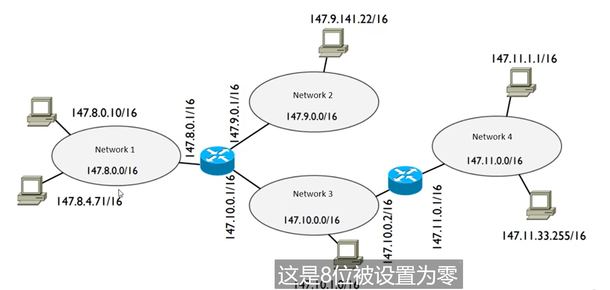
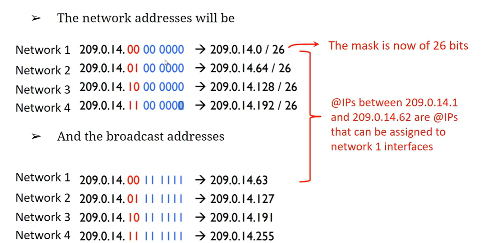
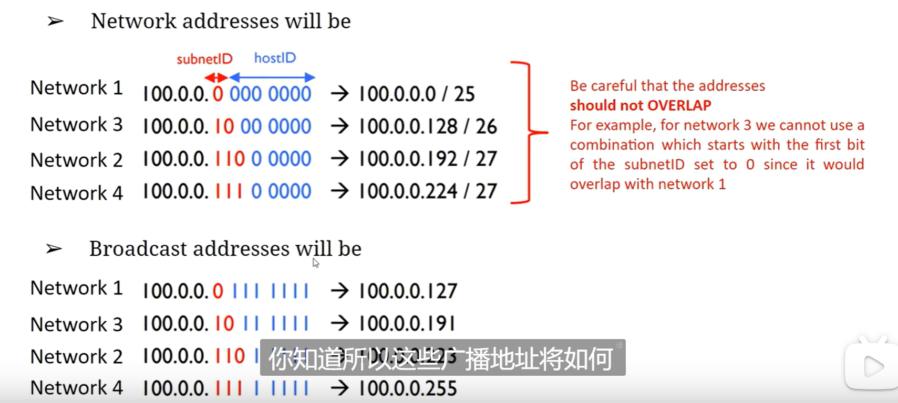
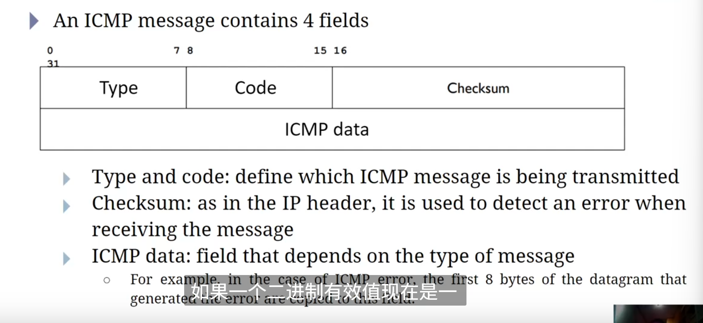
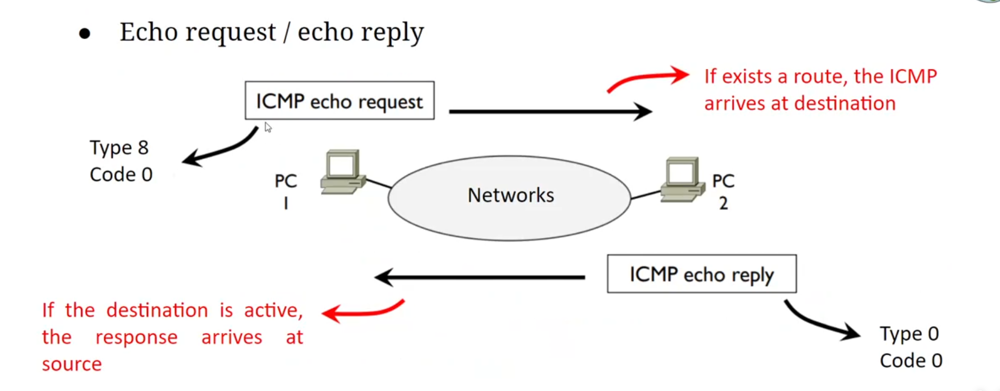
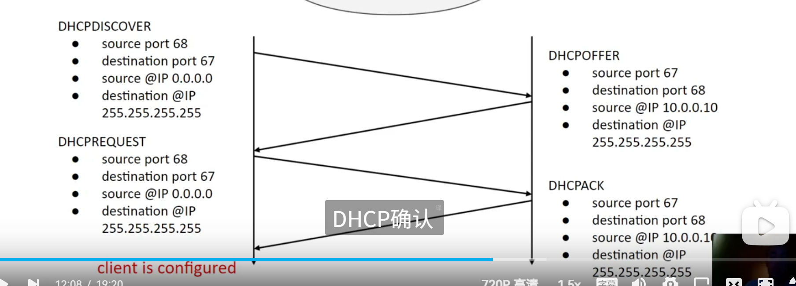

## Introduction to IP networks

the base inforamtion is the datagram
Three properties of the datagrams: 1. Each datagram is independent of the others and can be delivered in no particular order. 2. Each datagram is treated to the best of its ability 3. A datagram can be lost and there is no recovery mechanism

Unicast: A single destination
Broadcast: All destination
Multicast: A group

IP Address
32-bit number
147.83.104.2
netid- network identifier
hostID the hostId Machine that belongs to the netID network

How do we recognize the host and netid?
using maskes-most used
Masks:
255.255.255.0

147.83.3.4/16 16 ones

IP Assignment
@IP identifies an interface connected to a network that sends and receives datagrams
Mapped to layer 3 or highre equipment interfaces
Host and Router YES
Switch and Hub No
Why can't all 0 or all 1 be used in the host id
because all 0 is the network address
all 1 broadcast

    complex mask
    192-> 1100 0000
    /26
    88.101.100.47/26
    network id: 88.101.100.00
    hostid: 101111
    240->11110000

Subnetting
Idea: The range 147.8.0.0/16
65536 hosts can be connected to this network

209.0.14.00000000 -》209.0.14.0/26
209.0.14.01000000 -》209.0.14.64/26

ICMP
internet control message protocol
exchange of query or error bet 2 hosts / routers
generated directly at the ip level
an icmp can generate another icmp

echo request/echo reply

送回错误信息
错误 例子： 无法送达 type 3 然后会有 code 的选项
可以是 host protocol port 无法到达

DHCP
可以分配@IP 给用户并且提供可配置的 mask 网关 域名 proxy
可以自动 动态 手动
UDP 67 server 68 client

首先有一个 client 这个 client 会发送一个 DHCPDISCOVER 广播信息 寻找
server 只有 DHCP server 会 read and reply

DHCP offer 就是 reply 的过程 他会发送一个广播信息 然后告诉 nt 里所有 pc/ router 这个
客户的 IP

